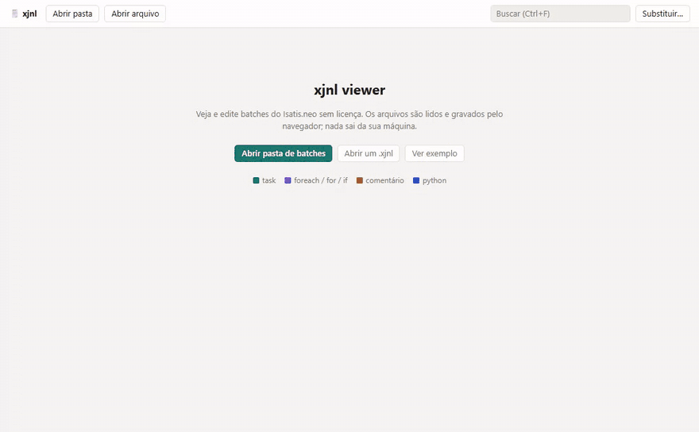

# xjnl-viewer

Visualizador e editor de batches do Isatis.neo (`.xjnl`) para máquinas sem licença.

**https://gstvschlz.github.io/xjnl-viewer/**



## Uso

No Edge ou no Chrome, abra uma pasta de batches e salve com Ctrl+S no próprio arquivo. Em outros navegadores, abra um `.xjnl`; o Salvar baixa uma cópia. O navegador lê e grava os arquivos na sua máquina, sem enviá-los a servidor algum.

No journal, você pode:

- editar valores, comentários e os cabeçalhos de `foreach`, `for` e `if`;
- mover, duplicar, apagar ou desativar blocos;
- buscar e substituir em todo o arquivo;
- validar a sintaxe dos blocos `python` no Python 3.11, a versão do Isatis.

O botão **Ver exemplo** abre [`exemplo/estimativa.xjnl`](exemplo/estimativa.xjnl), com dados fictícios.

## Fidelidade

Sem edição, o arquivo salvo é idêntico ao original byte a byte, então o diff mostra só o que você mudou. Para conferir uma pasta inteira:

```
mise run check [pasta]
```

Para rodar localmente: `mise run serve`.
